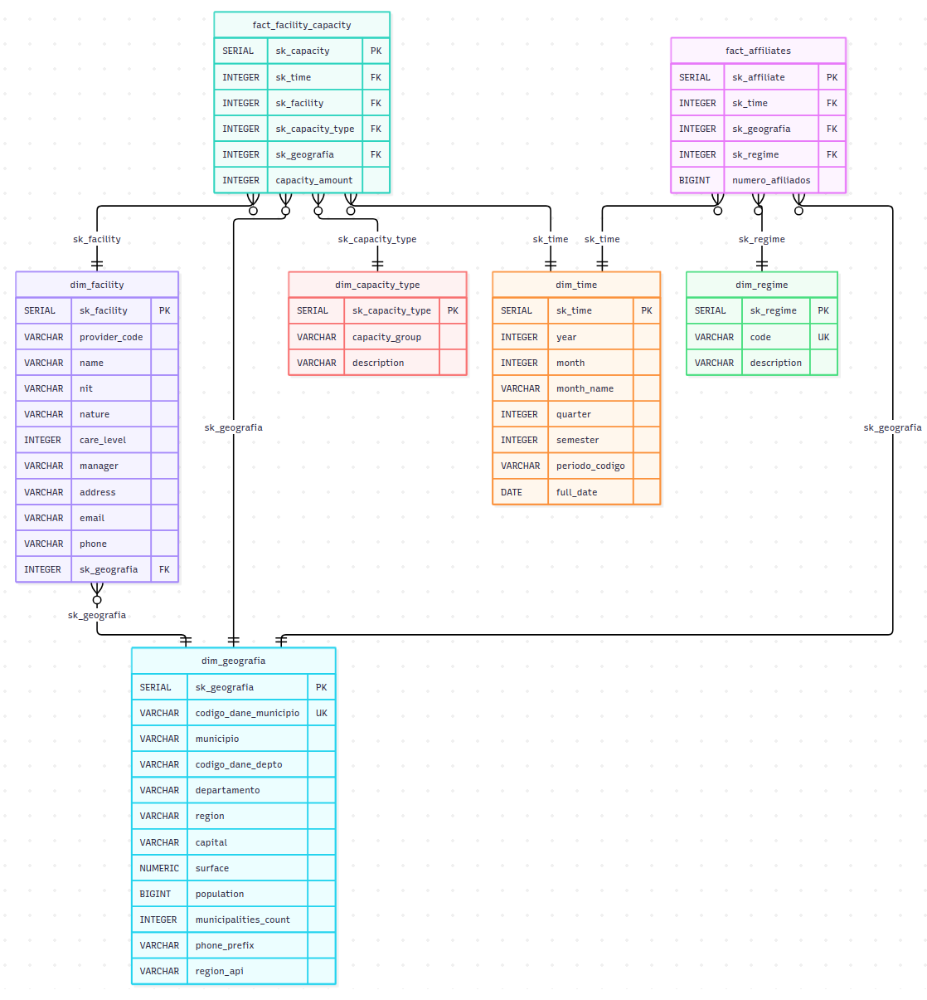
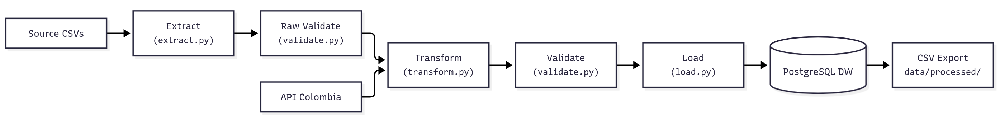
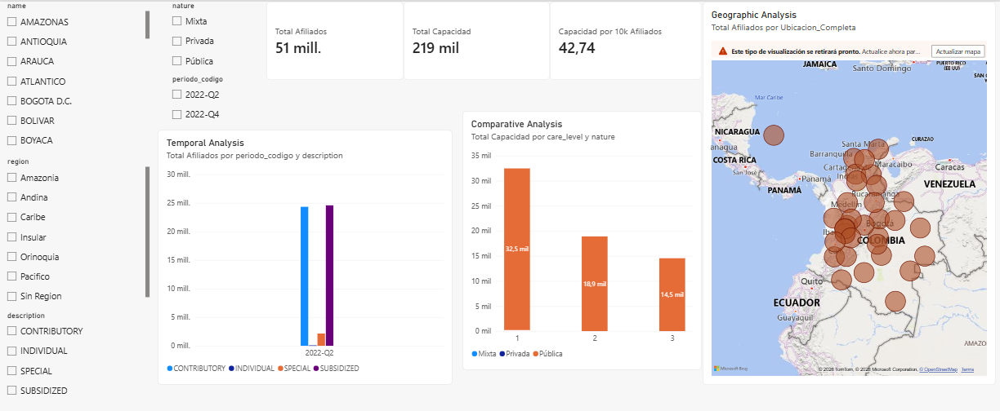
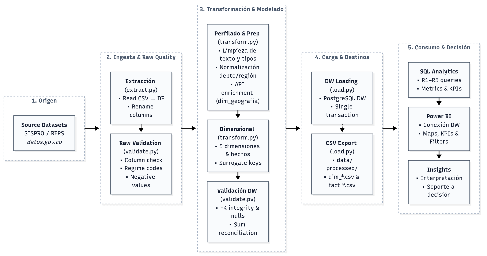

# ETL Health Colombia — ODS 3: Salud y Bienestar

**Course:** ETL (G01) — Data Engineering and Artificial Intelligence
**Phase:** 1 — From Analytical Requirements to a Dimensional Data Warehouse
**SDG:** Goal 3 — Good Health and Well-Being | Target 3.8: Achieve universal health coverage

---

## 1. Project Objective

### 1.1 General Objective

Design and implement an **ETL pipeline** that transforms raw healthcare data from Colombian open data sources into a **dimensional data warehouse** (star schema) to analyze geographic disparities in healthcare access, aligned with SDG Target 3.8.

### 1.2 Specific Objectives

| # | Objective | Deliverable |
|---|-----------|-------------|
| O1 | Profile and clean raw datasets (affiliates + facilities) | Clean CSV files with data quality fixes |
| O2 | Design a normalized star schema (5 dimensions, 2 fact tables) | `sql/init.sql` DDL script |
| O3 | Build an automated ETL pipeline (Extract → Transform → Validate → Load) | `src/` Python modules |
| O4 | Enrich geographic data with API Colombia (capital, surface, population) | `dim_geografia` with external data |
| O5 | Load data into PostgreSQL and export CSVs for BI tools | PostgreSQL DW + `data/processed/` CSVs |
| O6 | Answer 5 analytical requirements (R1–R5) with SQL queries | `sql/analytical_queries.sql` |
| O7 | Visualize results in Power BI dashboard | `visualizations/dashboard.png` |

### 1.3 Project Granularity

| Aspect | Scope |
|--------|-------|
| **Geographic** | National — 33 departments + Bogotá D.C., 1,046+ municipalities |
| **Temporal** | Cross-sectional snapshots: Q2 2022 (affiliates), Q4 2022 (facilities) |
| **Institutional** | Healthcare facilities (IPS) registered in REPS |
| **Regime** | Subsidized, Contributory, Special, Individual |
| **Infrastructure** | Beds (CAMAS), procedural rooms (SALAS), equipment by care level |

### 1.4 Expected Results

- **5 dimension tables**: `dim_time`, `dim_geografia`, `dim_regime`, `dim_facility`, `dim_capacity_type`
- **2 fact tables**: `fact_affiliates` (3,369 rows), `fact_facility_capacity` (31,496 rows)
- **Unified geography dimension** enriched with API Colombia data (capital, surface, population)
- **Power BI dashboard** with geographic maps, KPIs, and regime distribution charts
- **5 analytical queries** answering R1–R5 requirements

---

## 2. Colombian Problem Definition

Colombia's healthcare system faces significant territorial disparities in access to services. While the country has achieved high affiliation rates through the General System of Social Security in Health (SGSSS), the distribution of healthcare infrastructure (beds, equipment, specialized services) does not proportionally match the population's needs across departments and municipalities. Some regions maintain high capacity per affiliate while others face critical shortages.

This analysis focuses on two complementary dimensions of healthcare access:

1. **Affiliation coverage**: How many affiliates are enrolled per regime (Subsidized/Contributory) across municipalities and departments.
2. **Infrastructure capacity**: How much installed capacity (beds, procedural rooms, equipment) exists per healthcare facility.

Understanding the relationship between affiliation density and infrastructure capacity is essential for identifying underserved regions and informing resource allocation decisions.

**Geographic scope:** National (33 departments + Bogotá D.C.), across all municipalities.

**Population of interest:** Affiliates of the Colombian healthcare system and healthcare facilities (IPS).

**Potential stakeholders:** Ministry of Health and Social Protection (Minsalud), departmental health secretaries, EPS (healthcare promoting entities), hospital managers, healthcare policy researchers.

---

## 3. Analytical Requirements (R1–R5)

**Analytical Objective:** Analyze the distribution of healthcare affiliates and infrastructure capacity across Colombian territories to identify geographic disparities and support resource allocation decisions aligned with SDG Target 3.8.

### Requirements Matrix

| ID | Analytical Requirement | Business Question | Decision / Insight Supported |
|----|----------------------|-------------------|------------------------------|
| R1 | Determine the total number of affiliates by regime type nationally | How many Colombians are affiliated to each regime (Subsidized, Contributory, Special, Individual)? | Understand the composition of the healthcare system and the relative weight of each regime for policy planning. |
| R2 | Identify the departments with the highest and lowest affiliate density | Which departments concentrate the most/least affiliates, and how does this relate to their population? | Detect territorial disparities in healthcare coverage to prioritize interventions in underserved departments. |
| R3 | Analyze the distribution of healthcare facilities by nature (public/private) and care level | What is the public-private mix of healthcare providers and at what care levels do they operate? | Evaluate whether the private sector complements or duplicates public infrastructure, informing public investment decisions. |
| R4 | Compare installed capacity (beds, rooms) per affiliate across departments | Which departments have sufficient infrastructure relative to their affiliated population? | Identify regions where infrastructure expansion is needed to meet demand. |
| R5 | Assess the relationship between regime type and geographic distribution | Are Subsidized regime affiliates concentrated in different territories than Contributory regime affiliates? | Understand whether healthcare regime segmentation maps to geographic inequity, supporting targeted policy design. |

---

## 4. SDG Alignment

**SDG 3 — Good Health and Well-Being**
**Target 3.8:** Achieve universal health coverage (UHC), including financial risk protection, access to quality essential healthcare services, and access to safe, effective, quality, and affordable essential medicines and vaccines for all.

This project directly addresses Target 3.8 by analyzing:

- **Coverage breadth** (R1, R2): Measuring how many Colombians are affiliated to the healthcare system and where they are located.
- **Service availability** (R3, R4): Assessing whether healthcare infrastructure exists to serve the affiliated population.
- **Equity** (R5): Examining whether access to healthcare services is equitably distributed across regimes and territories.

Colombia's SGSSS achieves ~99% affiliation nationally, but affiliation does not guarantee access. Infrastructure gaps, geographic barriers, and regime-based service differences create effective disparities in healthcare access. This analysis provides the data foundation to identify and quantify these gaps.

---

## 5. Dataset Source Selection

| Characteristic | Affiliates Dataset | Facilities Dataset |
|---|---|---|
| **Source** | SISPRO — Sistema Integrado de Información de la Protección Social | REPS — Registro Especial de Prestadores de Servicios de Salud |
| **Institution / Owner** | Ministerio de Salud y Protección Social (Minsalud) | Ministerio de Salud y Protección Social (Minsalud) |
| **URL** | https://www.datos.gov.co/Salud-y-Protecci-n-Social/Relaci-n-de-IPS-p-blicas-y-privadas-seg-n-el-nivel/s2ru-bqt6/about_data  | https://www.datos.gov.co/Salud-y-Protecci-n-Social/N-mero-de-afiliados-por-departamento-municipio-y-r/hn4i-593p/about_data  |
| **Mechanism** | CSV download from Datos Abiertos Colombia | CSV download from Datos Abiertos Colombia |
| **Format** | CSV (comma-separated, period as thousand separator) | CSV (comma-separated) |
| **Records** | 3,369 rows | 41,427 rows |
| **Attributes** | 8 columns | 20 columns |
| **Geographic Coverage** | 34 departments, 1,046 municipalities | 38 departments, all major municipalities |
| **Temporal Coverage** | April 2022 (Q2 2022 snapshot) | November 2022 (Q4 2022 snapshot, REPS cutoff) |
| **Numerical Measures** | `NumPersonas` (number of affiliates per department/municipality/regime/month) | `num cantidad capacidad instalada` (installed capacity: beds, procedural rooms, equipment) |
| **Categorical Attributes** | Department, Municipality, Regime type (S/C/E/I) | Department, Municipality, Nature (Public/Private/Mixed), Care Level, Capacity Group, Capacity Description |

### Dataset Suitability Matrix

| Criterion | Assessment |
|---|---|
| **Institution / Data Owner** | Ministerio de Salud y Protección Social (Minsalud) |
| **Source** | SISPRO (affiliates) / REPS (facilities) |
| **URL** | datos.gov.co — Official open data portal |
| **Mechanism** | Direct CSV download |
| **Format** | CSV |
| **Number of Records** | 3,369 (affiliates) + 41,427 (facilities) = 44,796 total |
| **Number of Attributes** | 8 (affiliates) + 20 (facilities) |
| **Geographic Coverage** | National — all 33 departments + Bogotá D.C. |
| **Temporal Coverage** | Q2 2022 (affiliates), Q4 2022 (facilities) — cross-sectional snapshots |
| **Relevant Numerical Measures** | Number of affiliates, installed capacity (beds, rooms, equipment) |
| **Relevant Categorical Attributes** | Regime type, department, municipality, facility nature, care level, capacity type |
| **Potential Data-Quality Issues** | Periods as thousand separators in NumPersonas; 61% null care_level in facilities; some missing contact data; duplicate facility rows for different capacity types |
| **Relationship with Requirements** | R1→NumPersonas by regime; R2→NumPersonas by department; R3→nature/care_level; R4→capacity vs affiliates; R5→regime × geography |
| **Suitability for Dimensional Modeling** | High — clear grain (affiliation row per dept/muni/regime/month; facility row per provider/capacity type), natural dimensions (time, geography, regime, facility, capacity type) |
| **Unit of Observation (Source)** | Affiliates: one row = total affiliates for a regime in a municipality for a month. Facilities: one row = installed capacity entry for a facility and capacity type. |

---

## 6. Data Profiling and Quality Assessment

### 5.1 Affiliates Dataset

| Attribute | Type | Nulls | Unique Values | Notes |
|---|---|---|---|---|
| CodDepto | String | 0 | 34 | Department DANE code |
| Departamento | String | 0 | 34 | Department name |
| CodMunicipio | String | 0 | 1,046 | Municipality DANE code |
| Municipio | String | 0 | 1,046 | Municipality name |
| IDRegimen | String | 0 | 4 | S=Subsidized, C=Contributory, E=Special, I=Individual |
| Año | String | 0 | 1 | 2022 |
| Mes | String | 0 | 1 | 4 (April only) |
| NumPersonas | String | 0 | — | Range: 1–6,410,877. Sum: 51,182,238. Period used as thousand separator. |

**Quality Issues:**
- NumPersonas stored as string with period thousand separators (e.g., "2.194" = 2,194)
- Temporal coverage limited to single month (April 2022)
- No null values detected
- No fully duplicated rows

### 5.2 Facilities Dataset

| Attribute | Type | Nulls | Unique Values | Notes |
|---|---|---|---|---|
| Departamento | String | 0 | 38 | Department name |
| Municipio | String | 0 | — | Municipality name |
| Código prestador | String | 0 | — | Unique provider identifier |
| Nombre prestador | String | 0 | — | Facility name |
| nit IPS | String | 0 | — | NIT with comma separators |
| naturaleza | String | 0 | 3 | Pública, Privada, Mixta |
| num nivel atencion | String | 25,266 (61.0%) | — | Care level (1–4) |
| nom grupo capacidad | String | 0 | — | CAMAS, SALAS, etc. |
| nom descripcion capacidad | String | 0 | — | TPR, Adultos, Pediátrica, etc. |
| num cantidad capacidad instalada | String | 0 | — | Range: 1–650+ |
| Fecha Corte | String | 0 | 1 | November 5, 2022 |
| Gerente | String | 225 (0.5%) | — | Manager name |
| Email | String | 65 (0.2%) | — | Contact email |
| Teléfono | String | 1,309 (3.2%) | — | Contact phone |

**Quality Issues:**
- 61% null values in `num nivel atencion` (care level) — not all facilities report this
- NIT contains comma separators requiring cleanup
- Phone numbers have inconsistent formatting
- Each facility may appear multiple rows (one per capacity type entry)
- Some missing contact information (manager, email, phone)

---

## 7. Requirements-to-Data Traceability

| Requirement | Required Attributes | Transformation Needed | Expected KPI / Analysis |
|---|---|---|---|
| **R1** — Affiliates by regime | `IDRegimen`, `NumPersonas` | Parse NumPersonas (remove separators), aggregate by regime | Total affiliates per regime type (S, C, E, I) |
| **R2** — Department density | `Departamento`, `NumPersonas`, `CodDepto` | Aggregate by department, normalize by population or area | Top/bottom departments by affiliate count |
| **R3** — Facilities by nature/level | `naturaleza`, `num nivel atencion`, `Código prestador` | Deduplicate facilities, aggregate by nature and care level | Distribution of public vs private by care level |
| **R4** — Capacity per affiliate | `num cantidad capacidad instalada`, `NumPersonas`, `Departamento` | Join affiliates and facilities via department, compute capacity/affiliate ratio | Capacity-to-affiliate ratio by department |
| **R5** — Regime × Geography | `IDRegimen`, `Departamento`, `Municipio`, `NumPersonas` | Pivot regime by geography, compute regime distribution per department | Subsidized vs Contributory concentration by region |

---

## 8. Data Preparation Strategy

| Issue Detected | Strategy | Justification |
|---|---|---|
| **NumPersonas as string with periods** | Remove thousand-separator periods, convert to integer | Required for numeric aggregation in fact tables |
| **NIT with commas** | Remove commas from NIT strings | Standardize identifier format for dimension matching |
| **Phone number formatting** | Extract numeric digits only using regex | Normalize inconsistent phone formats for dimension storage |
| **Department name normalization** | Uppercase, remove accents (NFKD), map aliases (e.g., "VALLE" → "VALLE DEL CAUCA") | Ensure consistent department names across datasets for joins |
| **"NO APLICA" department** | Map to "SIN DEPARTAMENTO" with DANE code "00" (preserves 1,315,701 affiliates) | Records without geographic assignment are retained for sum consistency; synthetic code "00" allows traceability |
| **Zero affiliates** | Drop rows where NumPersonas ≤ 0 | Zero-count records do not contribute to analytical value |
| **Missing care level (61% null)** | Store as NULL (nullable integer) | Care level is not critical for capacity analysis; NULL preserves data integrity without introducing artificial categories |
| **Duplicate facility rows** | Keep unique (provider_code, municipality) combinations | Each facility appears once in dim_facility; capacity types are separate entries |
| **Derived: quarter, periodo_codigo** | Compute quarter from month, generate "YYYY-QN" code | Enables temporal aggregation at quarterly granularity |
| **Derived: region** | Map departments to 6 official regions (Amazonia, Andina, Caribe, Insular, Orinoquia, Pacifico) | Enables regional-level analysis required by R2 and R5 |

---

## 9. Grain Declaration

**One row in `fact_affiliates` represents** the total number of accumulated healthcare affiliates for a specific regime type (Subsidized, Contributory, Special, or Individual) in a specific geography (municipality/department/region) during a specific quarter (Q2 2022).

**One row in `fact_facility_capacity` represents** the installed capacity (beds, procedural rooms, or equipment) for a specific healthcare facility (IPS), a specific capacity type, and a specific geography at a point in time (Q4 2022 snapshot).

---

## 10. Dimensional Data Model

### 9.1 Star Schema

The dimensional model was simplified to a unified 5-dimension star schema. Both fact tables reference a **single conformed geography dimension** (`dim_geografia`), which is enriched with API Colombia data (capital, surface, population, municipalities_count, phone_prefix, region_api).



### 9.2 Dimension and Fact Justification

| Table | Justification |
|---|---|
| **dim_time** | Temporal analysis is required by R1, R2, R4, R5. Quarterly granularity matches the data snapshot. Semester and year enable multi-level temporal roll-ups. |
| **dim_geografia** | **Conformed geography dimension** used by both fact tables. Includes DANE codes, municipality, department, region, and API Colombia enrichment (capital, surface, population, municipalities_count, phone_prefix, region_api). Eliminates redundant geographic tables. |
| **dim_regime** | Regime type is the core analytical dimension for R1, R5. Maps S/C/E/I codes to descriptive names. |
| **dim_facility** | Facility-level analysis required by R3, R4. Contains provider attributes (nature, care level, contact) for descriptive slicing. References `dim_geografia` via `sk_geografia` FK. |
| **dim_capacity_type** | Capacity types (CAMAS/SALAS × TPR/Adultos/Pediátrica) required for R3, R4 infrastructure analysis. |
| **fact_affiliates** | Stores the measure `numero_afiliados` at the grain: quarter + geography + regime. Supports R1, R2, R5. References `dim_geografia` directly. |
| **fact_facility_capacity** | Stores the measure `capacity_amount` at the grain: facility + capacity type + geography + time snapshot. Supports R3, R4. References `dim_geografia` directly for geographic analysis. |

### 9.3 Why Two Fact Tables?

The two fact tables have **different granularities**:
- `fact_affiliates` is aggregated at (quarter, geography, regime) — a many-to-many relationship between territory and regime.
- `fact_facility_capacity` is at (facility, capacity type, geography, time) — individual facility-level infrastructure data.

Both reference the same conformed `dim_geografia` dimension directly, enabling cross-fact geographic analysis (e.g., capacity per affiliate by department) without duplicating geographic data.

### 9.4 Normalization Changes (v3)

| Change | Before (v2) | After (v3) | Rationale |
|---|---|---|---|
| Geography dimension | `dim_geografia` used by affiliates; `dim_department`/`dim_municipality` used by facilities; `dim_department_api` for API enrichment | **Single `dim_geografia`** used by both fact tables, enriched with API Colombia data | Eliminates geographic redundancy; API attributes (capital, surface, population) live directly in `dim_geografia` |
| Removed tables | `dim_department`, `dim_municipality`, `dim_department_api` existed as separate dimensions | **Removed** — all geographic data unified in `dim_geografia` | Reduces schema complexity from 8 dimensions to 5; eliminates unnecessary hierarchy helpers |
| `dim_facility` geography FK | Referenced `dim_municipality` | References `dim_geografia` via `sk_geografia` FK | Direct geographic linkage without intermediate municipality dimension |
| `fact_facility_capacity` geography | Had `sk_geografia` FK through separate path | Direct `sk_geografia` FK to unified dimension | Simplified geographic analysis without joins through facility hierarchy |

---

## 11. ETL Pipeline

### 10.1 Architecture




### 10.2 Extract (`src/extract.py`)
- Reads raw CSV files with `pd.read_csv(dtype=str)` to preserve original formatting
- Renames columns from Spanish to English for consistency
- No business transformations applied during extraction

### 10.3 Transform (`src/transform.py`)

**Data Preparation:**
- Removes thousand-separator periods from `NumPersonas`, converts to integer
- Normalizes department and municipality names (accent removal, uppercase, alias mapping)
- Maps departments to regions using `REGION_MAP` (after normalization, ensuring correct mapping)
- Drops records with "NO APLICA" departments and zero affiliates
- Extracts numeric digits from phone numbers
- Removes commas from NIT values

**Dimensional Transformation:**
- Builds **5 dimension tables** with surrogate keys (`sk_*`): `dim_time`, `dim_geografia`, `dim_regime`, `dim_facility`, `dim_capacity_type`
- Constructs unified `dim_geografia` from both affiliates and facilities datasets, enriched with API Colombia data (capital, surface, population, municipalities_count, phone_prefix, region_api)
- `dim_facility` references `dim_geografia` via `sk_geografia` FK
- Aggregates `fact_affiliates` to quarterly granularity
- Maps facility composite keys (provider_code + municipality) to surrogate keys
- Both fact tables reference `dim_geografia` directly for geographic analysis

### 10.4 Validate (`src/validate.py`)

| Rule | Description |
|---|---|
| **Raw Validation** | Validates raw data before transformation: required columns, no negative NumPersonas, valid regime codes (S/C/E/I) |
| **FK Integrity** | All foreign keys in fact tables reference existing surrogate keys in dimension tables |
| **Null Measures** | No null values in measure columns (`numero_afiliados`, `capacity_amount`) |
| **Negative Measures** | No negative values in measure columns |
| **Duplicate Keys** | No duplicate composite keys in fact tables |
| **Sum Consistency** | Total `numero_afiliados` in fact table matches source total within 1% tolerance |

### 10.5 Load (`src/load.py`)
- Connects to PostgreSQL using `psycopg2`
- Executes `sql/init.sql` to reset schema (idempotent DROP + CREATE)
- Loads dimensions first, then fact tables
- Uses `ON CONFLICT DO NOTHING` for idempotency
- Resets serial sequences after load (`setval`)
- Single transaction: commits on success, rolls back on failure
- **CSV Export:** After PostgreSQL load, exports all dimension and fact tables as individual CSV files to `data/processed/` for alternative BI tool ingestion (e.g., Power BI direct CSV import)

---

## 12. Requirements-to-Model Validation

| Requirement | Dimension(s) | Measure(s) | Expected Query/KPI | Supported? |
|---|---|---|---|---|
| **R1** — Affiliates by regime | dim_regime, dim_time | numero_afiliados | Total affiliates grouped by regime description | Yes |
| **R2** — Department density | dim_geografia, dim_time | numero_afiliados | Top/bottom departments by total affiliates | Yes |
| **R3** — Facilities by nature/level | dim_facility, dim_capacity_type | capacity_amount | Count of facilities by nature; capacity by care level | Yes |
| **R4** — Capacity per affiliate | dim_facility, dim_geografia | capacity_amount, numero_afiliados | capacity_amount / numero_afiliados ratio by department | Yes |
| **R5** — Regime × Geography | dim_regime, dim_geografia | numero_afiliados | Subsidized vs Contributory distribution across departments | Yes |


---

## 13. Analytical Queries and KPIs

All queries run against the PostgreSQL Data Warehouse.

### R1 — Total Affiliates by Regime Type

```sql
SELECT
    r.description AS regime,
    SUM(f.numero_afiliados) AS total_affiliates,
    ROUND(SUM(f.numero_afiliados) * 100.0 / SUM(SUM(f.numero_afiliados)) OVER(), 2) AS pct_share
FROM fact_affiliates f
JOIN dim_regime r ON f.sk_regime = r.sk_regime
GROUP BY r.description
ORDER BY total_affiliates DESC;
```

| DW Tables | Metric/KPI | Main Result |
|---|---|---|
| fact_affiliates, dim_regime | Total affiliates per regime; percentage share | Subsidized and Contributory regimes are nearly balanced nationally (~48% vs ~47.5%), with Special and Individual regimes representing <5%. The real disparity emerges at the regional level (see R5). |

### R2 — Top and Bottom Departments by Affiliate Count

```sql
SELECT department, total_affiliates, 'Top 10' AS category FROM (
    SELECT g.departamento AS department, SUM(f.numero_afiliados) AS total_affiliates
    FROM fact_affiliates f
    JOIN dim_geografia g ON f.sk_geografia = g.sk_geografia
    GROUP BY g.departamento
    ORDER BY total_affiliates DESC
    LIMIT 10
) top10
UNION ALL
SELECT department, total_affiliates, 'Bottom 10' AS category FROM (
    SELECT g.departamento AS department, SUM(f.numero_afiliados) AS total_affiliates
    FROM fact_affiliates f
    JOIN dim_geografia g ON f.sk_geografia = g.sk_geografia
    GROUP BY g.departamento
    ORDER BY total_affiliates ASC
    LIMIT 10
) bottom10
ORDER BY category DESC, total_affiliates DESC;
```

| DW Tables | Metric/KPI | Main Result |
|---|---|---|
| fact_affiliates, dim_geografia | Top and bottom departments by affiliate volume | Bogotá D.C., Antioquia, and Valle del Cauca concentrate the largest affiliate populations. Smaller departments like Vaupés, Guainía, and Vichada have the fewest affiliates, reflecting low population density. |

### R3 — Facilities by Nature and Care Level

```sql
SELECT
    fc.nature,
    fc.care_level,
    COUNT(DISTINCT fc.sk_facility) AS facility_count,
    SUM(c.capacity_amount) AS total_capacity
FROM fact_facility_capacity c
JOIN dim_facility fc ON c.sk_facility = fc.sk_facility
GROUP BY fc.nature, fc.care_level
ORDER BY fc.nature, fc.care_level;
```

| DW Tables | Metric/KPI | Main Result |
|---|---|---|
| fact_facility_capacity, dim_facility | Facility count and capacity by nature and care level | Public facilities dominate high-complexity care (levels 3–4), while private facilities concentrate in lower-complexity services (levels 1–2). |

### R4 — Installed Capacity per Affiliate by Department

```sql
WITH capacity_by_dept AS (
    SELECT
        g.departamento AS department,
        SUM(c.capacity_amount) AS total_capacity
    FROM fact_facility_capacity c
    JOIN dim_geografia g ON c.sk_geografia = g.sk_geografia
    WHERE g.departamento NOT IN ('SIN DEPARTAMENTO')
    GROUP BY g.departamento
),
affiliates_by_dept AS (
    SELECT
        g.departamento AS department,
        SUM(f.numero_afiliados) AS total_affiliates
    FROM fact_affiliates f
    JOIN dim_geografia g ON f.sk_geografia = g.sk_geografia
    WHERE g.departamento NOT IN ('SIN DEPARTAMENTO')
    GROUP BY g.departamento
)
SELECT
    COALESCE(a.department, c.department) AS department,
    COALESCE(c.total_capacity, 0) AS total_capacity,
    COALESCE(a.total_affiliates, 0) AS total_affiliates,
    ROUND(COALESCE(c.total_capacity, 0)::numeric / NULLIF(COALESCE(a.total_affiliates, 0), 0), 4) AS capacity_per_affiliate
FROM affiliates_by_dept a
FULL OUTER JOIN capacity_by_dept c ON a.department = c.department
ORDER BY capacity_per_affiliate ASC;
```

| DW Tables | Metric/KPI | Main Result |
|---|---|---|
| fact_affiliates, fact_facility_capacity, dim_geografia | Capacity-to-affiliate ratio by department | Smaller departments show highly variable ratios; some have excess capacity while others face critical shortages. SIN DEPARTAMENTO (non-geolocalized records) is excluded from this analysis. |

### R5 — Regime Distribution by Geographic Region

```sql
SELECT
    g.region,
    r.description AS regime,
    SUM(f.numero_afiliados) AS total_affiliates,
    ROUND(SUM(f.numero_afiliados) * 100.0 / SUM(SUM(f.numero_afiliados)) OVER(PARTITION BY g.region), 2) AS pct_within_region
FROM fact_affiliates f
JOIN dim_geografia g ON f.sk_geografia = g.sk_geografia
JOIN dim_regime r ON f.sk_regime = r.sk_regime
GROUP BY g.region, r.description
ORDER BY g.region, total_affiliates DESC;
```

| DW Tables | Metric/KPI | Main Result |
|---|---|---|
| fact_affiliates, dim_geografia, dim_regime | Affiliate distribution by region and regime; percentage within each region | The Andina region concentrates the majority of affiliates. Pacifico shows a strong Subsidized majority (driven by Valle del Cauca, Chocó, and Nariño). Amazonia has the highest proportional Subsidized concentration. |

---

## 14. ETL Validation Rules

| Rule Category | Validation | Implementation |
|---|---|---|
| **Row Counts** | Source row counts match transformed record counts | Logged at each ETL phase; notebook comparison |
| **Critical Nulls** | No nulls in PK/FK columns or measures | `validate_measures()` checks for nulls in `numero_afiliados` and `capacity_amount` |
| **Uniqueness** | No duplicate composite keys in fact tables | `validate_no_duplicates()` on (sk_time, sk_geografia, sk_regime) and (sk_time, sk_facility, sk_capacity_type) |
| **PK/FK Integrity** | All fact FKs reference existing dimension SKs | `validate_foreign_keys()` checks each FK against its dimension |
| **Referential Integrity** | Dimension surrogate keys are sequential and non-null | Serial sequences reset via `setval()` after load |
| **Business Rules** | NumPersonas > 0; valid regime codes (S, C, E, I) | Enforced during transform; validated in `validate_raw_affiliates()` |
| **Reconciliation** | Sum of fact measure matches source total within 1% | `validate_sum_consistency()` compares fact total vs. source sum |
| **Row Count Recovery** | Unique facilities in fact table match source unique facilities | `validate_row_count()` with `nunique('sk_facility')` vs `provider_code.nunique()` |

---

## 14.1 Data Quality Verification Results

After the full ETL pipeline execution, the following results confirm data integrity:

### Load Summary

| Table | Records | Description |
|---|---|---|
| dim_time | 2 | Q2 2022 (affiliates) + Q4 2022 (facilities) |
| dim_geografia | 2,240 | All municipalities with DANE codes, region, and API Colombia enrichment (capital, surface, population) |
| dim_regime | 4 | Subsidized, Contributory, Special, Individual |
| dim_facility | 10,921 | Unique healthcare providers (IPS) with sk_geografia FK |
| dim_capacity_type | 63 | CAMAS/SALAS × TPR/Adultos/Pediátrica combinations |
| fact_affiliates | 3,369 | Quarterly granularity (geography + regime) |
| fact_facility_capacity | 31,496 | Capacity rows per facility + capacity type + geography (deduplicated) |

### Validation Results

| Check | Result |
|---|---|
| FK nulls (fact_affiliates) | 0 |
| FK nulls (fact_facility_capacity) | 0 |
| Negative measures | 0 |
| Duplicate fact keys | 0 |
| Sum consistency (affiliates) | 51,182,238 = 51,182,238 (100% match) |
| Unmapped municipalities | 0 |
| Total validation errors | **0** |

### Data Quality Fixes Applied

| Issue | Root Cause | Fix |
|---|---|---|
| 5,072 facility rows silently dropped | Special health districts (Cali, Cartagena, Barranquilla, Santa Marta, Buenaventura) reported as "department" in REPS | `DISTRICT_TO_DEPT` mapping in `config.py` redirects to real departments |
| 80 municipalities unmapped | CAUCA missing from `DEPT_DANE_CODES`; facility-only municipalities not in affiliates dataset | Added CAUCA (code 19); unified `dim_geografia` now merges both datasets |
| 13,970 duplicate fact keys | Raw REPS data has duplicate rows per facility + capacity type | `build_fact_facility_capacity` now aggregates with `groupby().sum()` |
| 1,315,701 affiliates lost ("NO APLICA") | `DEPT_NORMALIZE['NO APLICA'] = None` caused silent drop | Map to "SIN DEPARTAMENTO" with DANE code "00"; `raw_total` computed before `clean_affiliates()` |
| Cauca without region | CAUCA absent from `REGION_MAP` | Added `'CAUCA': 'Pacifico'` |
| Validation false positive | `len(df_facilities)` compared total rows (41,427) against unique facilities (10,921) | Changed to `provider_code.nunique()` for apples-to-apples comparison |
| CASANARE wrong DANE code | CASANARE had code 19 (duplicate with CAUCA) | Corrected to 85 |
| Non-deterministic hash | Python `hash()` varies across runs | Replaced with `hashlib.md5()` |
| 29 facilities from AMAZONAS/GUAVIARE dropped | `DEPT_DANE_CODES` missing these two departments | Added `'AMAZONAS': '91'`, `'GUAVIARE': '95'` + new `validate_department_consistency()` check |
| Valle del Cauca (4.6M affiliates) mapped to "Sin Region" | `region` calculated in `extract.py` before `DEPT_NORMALIZE` corrected "VALLE" → "VALLE DEL CAUCA" | Moved `region` calculation to `clean_affiliates()` after normalization; added `validate_department_region_consistency()` |

---

## 15. Business Intelligence

A Power BI dashboard connects to the PostgreSQL Data Warehouse and provides:

- **Geographic Analysis:** Department-level map visualization showing affiliate density and capacity distribution.
- **Temporal Analysis:** Quarterly trend of affiliates by regime type.
- **Comparative Analysis:** Public vs. private facility distribution across care levels.
- **KPIs:** Total affiliates nationally, total installed capacity, capacity-to-affiliate ratio.
- **Filters:** By department, region, regime type, facility nature, and time period.

**Data Loading Options for Power BI:**
1. **PostgreSQL connection** (recommended): Direct connection to the Data Warehouse using the PostgreSQL connector. See "Connecting Power BI (Windows VM) to PostgreSQL (Linux Host)" below for VM setup instructions.
2. **CSV import**: Alternative — load individual CSV files from `data/processed/`. Each CSV includes surrogate keys for joining tables in Power BI.

**CSV files available in `data/processed/`:**

| File | Records | Content |
|------|---------|---------|
| `dim_time.csv` | 2 | Q2 2022 (affiliates) + Q4 2022 (facilities) |
| `dim_geografia.csv` | 2,240 | Municipalities with DANE codes, region, and API Colombia enrichment |
| `dim_regime.csv` | 4 | Subsidized, Contributory, Special, Individual |
| `dim_facility.csv` | 10,921 | Healthcare providers (IPS) with attributes and sk_geografia FK |
| `dim_capacity_type.csv` | 63 | CAMAS/SALAS × TPR/Adultos/Pediátrica |
| `fact_affiliates.csv` | 3,369 | Quarterly affiliate counts by geography/regime |
| `fact_capacity.csv` | 31,496 | Capacity records by facility, type, and geography |

> **Note:** Dashboard screenshots are saved in `visualizations/`. Source diagrams are in `diagrams/`.



---

## 16. Analytical Interpretation

### Finding 1: Subsidized Regime Concentration in Peripheral Regions

**What does the data show?** At the national level, Subsidized (~48%) and Contributory (~47.5%) regimes are nearly balanced. However, the geographic distribution reveals sharp disparities: the Subsidized regime is proportionally much higher in the Pacifico (Chocó, Valle del Cauca, Nariño) and Amazonia regions, while the Contributory regime dominates in Andina and Caribe. This regional concentration — rather than national majority — is the defining characteristic of the Colombian healthcare system's affiliation pattern.

**Which requirement does it address?** R5 — Relationship between regime type and geographic distribution.

**Why is it relevant in the Colombian context?** The Subsidized regime covers the lowest-income population. Its disproportionate concentration in peripheral regions (Pacifico, Amazonia) suggests these populations depend heavily on state-funded healthcare. However, these same regions often have fewer healthcare facilities, creating an access gap between affiliation and actual service delivery.

**What decision or further investigation could it support?** Target infrastructure investment in departments with high Subsidized affiliation but low capacity-to-affiliate ratios. Investigate whether Subsidized affiliates in these regions face longer wait times or travel distances.

### Finding 2: Capacity-to-Affiliate Ratio Disparity Across Departments

**What does the data show?** There is significant variation in the capacity-to-affiliate ratio across departments. Some departments (e.g., Amazonas, Vichada) show high capacity per affiliate due to low population density, while urban departments (Bogotá, Antioquia) show lower ratios despite having more absolute infrastructure.

**Which requirement does it address?** R4 — Compare installed capacity per affiliate across departments.

**Why is it relevant in the Colombian context?** Colombia's healthcare infrastructure follows population demand, but rural and remote departments may maintain capacity that exceeds local demand due to government investment programs. Conversely, rapidly growing urban areas may face infrastructure deficits.

**What decision or further investigation could it support?** Guide Minsalud's infrastructure expansion plans by identifying departments where capacity is genuinely insufficient vs. where high ratios reflect low utilization. Support decisions about facility relocation or mobile health units.

### Finding 3: Public-Private Mix Varies by Care Complexity

**What does the data show?** Public healthcare facilities dominate at higher care levels (3 and 4 — hospital and specialized care), while private facilities are more prevalent at lower care levels (1 and 2 — basic and intermediate care). A small number of facilities (15) report as "Mixta" (mixed nature), representing a marginal third category.

**Which requirement does it address?** R3 — Distribution of healthcare facilities by nature and care level.

**Why is it relevant in the Colombian context?** Colombia's healthcare system relies on private providers (IPS) contracted by EPS. The data reveals that complex, high-cost care remains predominantly public, while the private sector focuses on lower-complexity, higher-volume services. This has implications for referral pathways and waiting times.

**What decision or further investigation could it support?** Inform public-private partnership strategies. Evaluate whether incentivizing private investment in higher-complexity care could reduce burden on public hospitals. Assess geographic gaps where neither public nor private facilities provide adequate coverage.

---

## 17. System Architecture


---

## 18. Data Warehouse Implementation

### Prerequisites

- Python 3.9+
- PostgreSQL 12+ (or Docker/Podman)
- Docker Desktop (Windows) / Docker Engine (Linux) or Podman

### Option A: Local Setup (Without Docker)

```bash
# 1. Create database and user
psql -U postgres -c "CREATE DATABASE salud_colombia;"
psql -U postgres -c "CREATE USER etl_user WITH PASSWORD 'etl_password_2026';"
psql -U postgres -c "GRANT ALL PRIVILEGES ON DATABASE salud_colombia TO etl_user;"
psql -U postgres -d salud_colombia -c "GRANT USAGE, CREATE ON SCHEMA public TO etl_user;"

# 2. Install Python dependencies
pip install -r requirements.txt

# 3. Initialize schema
psql -U etl_user -d salud_colombia -f sql/init.sql

# 4. Run ETL
python -m src.etl_main
```

### Option B: Docker (Linux)

```bash
# Build and run everything
docker compose down -v
docker compose build --no-cache
docker compose up -d
docker compose run --rm etl

# Check logs
docker compose logs etl

# Stop all services
docker compose down -v
```

### Option C: Docker (Windows — PowerShell)

```powershell
# Build and run everything
docker compose down -v
docker compose build --no-cache
docker compose up -d
docker compose run --rm etl

# Check logs
docker compose logs etl

# Stop all services
docker compose down -v
```

### Option D: Podman (Linux)

```bash
# Build and run everything
podman-compose down -v
podman-compose build --no-cache
podman-compose up -d
podman-compose run --rm etl

# Check logs
podman-compose logs etl

# Stop all services
podman-compose down -v
```

### Option E: Podman (Windows — PowerShell)

```powershell
# Build and run everything
podman-compose down -v
podman-compose build --no-cache
podman-compose up -d
podman-compose run --rm etl

# Check logs
podman-compose logs etl

# Stop all services
podman-compose down -v
```

### ETL Pipeline Output

When you run the ETL pipeline, you should see the following output:

```
============================================================
  ETL Salud Colombia — Warehouse Dimensional
============================================================

PHASE 1: EXTRACTION
[EXTRACT] Extracting affiliates from: data/raw/affiliates_by_department_municipality_regime_20260906.csv
[EXTRACT] Records extracted: 3369
[EXTRACT] Extracting facilities from: data/raw/healthcare_facilities_by_level_capacity_20260906.csv
[EXTRACT] Records extracted: 41427

PHASE 1.5: RAW VALIDATION
[VALIDATE] Raw validation passed

PHASE 2: TRANSFORMATION
[TRANSFORM] Cleaning affiliates dataset...
[TRANSFORM] Records after cleaning: 3369
[TRANSFORM] Cleaning facilities dataset...
[TRANSFORM] Records after cleaning: 41427
[TRANSFORM] Building dimensions...
[TRANSFORM] Time dimension records: 2
[TRANSFORM] Geography dimension records: 2240 (enriched with API Colombia)
[TRANSFORM] Regime dimension records: 4
[TRANSFORM] Facility dimension records: 10921
[TRANSFORM] Capacity type dimension records: 63
[TRANSFORM] Building fact tables...
[TRANSFORM] Affiliates fact records (quarterly): 3369
[TRANSFORM] Facility capacity fact records: 31496

PHASE 2.5: VALIDATION
[VALIDATE] All validations passed successfully

PHASE 3: LOADING
[LOAD] Schema reset from init.sql
[LOAD] Loading dimension dim_time: 2 records
[LOAD] Loading dimension dim_geografia: 2240 records
[LOAD] Loading dimension dim_regime: 4 records
[LOAD] Loading dimension dim_facility: 10921 records
[LOAD] Loading dimension dim_capacity_type: 63 records
[LOAD] Loading fact table fact_affiliates: 3369 records
[LOAD] Loading fact table fact_facility_capacity: 31496 records
[LOAD] Load completed successfully

PHASE 4: CSV EXPORT
[EXPORT] Exported dim_time: 2 records
[EXPORT] Exported dim_geografia: 2240 records
[EXPORT] Exported dim_regime: 4 records
[EXPORT] Exported dim_facility: 10921 records
[EXPORT] Exported dim_capacity_type: 63 records
[EXPORT] Exported fact_affiliates: 3369 records
[EXPORT] Exported fact_capacity: 31496 records

============================================================
  ETL PROCESS COMPLETED SUCCESSFULLY
============================================================
```

### Environment Variables

| Variable | Default | Description |
|---|---|---|
| `DB_HOST` | localhost (local) / postgres (Docker) | PostgreSQL host |
| `DB_PORT` | 5432 | PostgreSQL port |
| `DB_NAME` | salud_colombia | Database name |
| `DB_USER` | etl_user | Database user |
| `DB_PASSWORD` | etl_password_2026 | Database password |

### Connecting with DBeaver

DBeaver is a free, universal database tool used to visualize and query the Data Warehouse.

1. **Download and install** DBeaver from https://dbeaver.io/download
2. **Create a new connection:**
   - Open DBeaver → Click "New Database Connection" (plug icon)
   - Select **PostgreSQL** → Click Next
3. **Configure the connection:**

| Field | Value |
|---|---|
| Server Host | `localhost` (local) or `localhost` (Docker, since port 5432 is mapped) |
| Port | `5432` |
| Database | `salud_colombia` |
| Username | `etl_user` |
| Password | `etl_password_2026` |

4. **Test the connection** → Click "Finish"
5. **Verify the schema:**
   - Expand `salud_colombia` → Schemas → `public` → Tables
   - You should see: `dim_time`, `dim_geografia`, `dim_regime`, `dim_facility`, `dim_capacity_type`, `fact_affiliates`, `fact_facility_capacity`
6. **Run analytical queries:**
   - Open a SQL editor (right-click `salud_colombia` → SQL Editor → New SQL Editor)
   - Paste queries from `sql/analytical_queries.sql`
   - Execute with Ctrl+Enter

> **Note:** If using Docker, the PostgreSQL port is exposed on `5432` by default. If that port is already in use, change the mapping in `docker-compose.yml` (e.g., `"5433:5432"`) and update `DB_PORT` in your `.env` file.

### Connecting Power BI (Windows VM) to PostgreSQL (Linux Host)

If you are running Power BI Desktop on a Windows virtual machine and PostgreSQL is running on a Linux host (via Podman/Docker), follow these steps to establish the connection.

#### Prerequisites

- Power BI Desktop installed on the Windows VM
- PostgreSQL running on the Linux host (via Podman/Docker)
- Network connectivity between the VM and the Linux host

#### Step 1: Find the Linux Host IP Address

On the Linux host, run:

```bash
ip addr show virbr0 2>/dev/null || ip addr show | grep "inet " | grep -v 127.0.0.1
```

The default libvirt/virbr0 network IP is typically `192.168.122.1`.

#### Step 2: Configure the Connection in Power BI

1. Open **Power BI Desktop** on the Windows VM
2. Click **Get Data** → **More...**
3. Select **PostgreSQL database** and click **Connect**
4. Enter the connection settings:

| Setting | Value |
|---------|-------|
| **Server** | `<LINUX_HOST_IP>:5432` (e.g., `192.168.122.1:5432`) |
| **Database** | `salud_colombia` |
| **Data Connectivity mode** | `Import` (recommended for development) or `DirectQuery` |

5. Click **OK**

#### Step 3: Authenticate

In the authentication dialog:

| Tab | Setting | Value |
|-----|---------|-------|
| **Database** | Username | `etl_user` |
| **Database** | Password | `etl_password_2026` |

6. Click **Connect**

#### Step 4: Handle SSL/Certificate Warnings

If Windows prompts to install the Npgsql connector or reports missing SSL certificates:

- Accept the warning for unencrypted connection on the internal virtual network
- This is safe for local/development environments

#### Step 5: Select Tables

1. In the Navigator, expand the `public` schema
2. Select the tables you want to import:

| Table | Content |
|-------|---------|
| `dim_time` | Time periods (Q2 2022, Q4 2022) |
| `dim_geografia` | Municipalities with DANE codes, region, and API Colombia enrichment |
| `dim_regime` | Regime types (Subsidized, Contributory, Special, Individual) |
| `dim_facility` | 10,921 healthcare facilities (IPS) with sk_geografia FK |
| `dim_capacity_type` | 63 capacity types (CAMAS/SALAS × TPR/Adultos/Pediátrica) |
| `fact_affiliates` | 3,369 affiliate records (quarterly granularity) |
| `fact_facility_capacity` | 31,496 capacity records |

3. Click **Load** or **Transform Data** if you need to clean the data first

#### Connection Summary

| Component | Value |
|-----------|-------|
| **Server IP** | `192.168.122.1` (default virbr0) or your host IP |
| **Port** | `5432` |
| **Database** | `salud_colombia` |
| **Username** | `etl_user` |
| **Password** | `etl_password_2026` |
| **SSL Mode** | `Prefer` or `Disable` (for local VMs) |

> **Note:** If the connection fails, ensure the PostgreSQL container is bound to `0.0.0.0:5432` (not just `127.0.0.1:5432`) so it accepts external connections. The `docker-compose.yml` in this project already configures this correctly.

---

## 19. Limitations and Assumptions

1. **Temporal snapshot limitation:** Both datasets are cross-sectional snapshots (Q2 2022 for affiliates, Q4 2022 for facilities). True temporal trend analysis would require multiple periods.
2. **Care level gaps:** 61% of facility records lack a care level value, limiting the granularity of care-level analysis. Missing values are stored as NULL in the data warehouse.
3. **Affiliation ≠ Access:** High affiliation rates do not necessarily guarantee effective healthcare access. The analysis measures system enrollment, not service utilization.
4. **Capacity definition:** `capacity_amount` represents installed capacity (beds, rooms, equipment), not operational or effective capacity.
5. **Facility municipalities:** Facilities in municipalities not present in the affiliates dataset are recovered via synthetic DANE codes (hashlib.md5) to preserve REPS data completeness.
6. **Cross-dataset comparison caveat:** R4 (capacity per affiliate) uses Q4 2022 capacity data with Q2 2022 affiliation data. The ratio is indicative, not temporally precise.

---

## 20. Technologies

| Component | Technology |
|---|---|
| Programming | Python 3.11, Pandas, NumPy, Requests |
| Profiling | Jupyter Notebook |
| Data Warehouse | PostgreSQL 12+ |
| ETL Pipeline | Python (extract.py → transform.py → validate.py → load.py) |
| BI Dashboard | Power BI |
| Version Control | Git, GitHub |

### Option F: Nix Flake (NixOS / Linux)

If you use Nix with the provided `flake.nix`, enter the development shell:

```bash
nix develop
```

This automatically sets up Python 3.12, PostgreSQL, Docker/Podman, Jupyter, and all dependencies.

**Available commands inside the Nix shell:**

| Command | Description |
|---|---|
| `docker-compose up -d` | Start infrastructure (Docker) |
| `podman-compose up -d` | Start infrastructure (Podman) |
| `docker-compose run --rm etl` | Run ETL pipeline |
| `./run_tests.sh unit` | Run unit tests |
| `./run_tests.sh all` | Run all tests |
| `jupyter lab` | Start JupyterLab |
| `jupyter notebook` | Start classic Jupyter Notebook |
| `uv pip install <pkg>` | Install a package |

---

## 21. Team Members and Responsibilities

| Member | Role | Responsibilities |
|---|---|---|
| Deyton Riascos Ortiz | Project Manager | Coordinate the project, organize tasks, consolidate the final report, and prepare the presentation |
| Samuel Izquierdo Bonilla | Development Team | Lead the definition of requirements, user stories, KPIs, and data mapping |
| Daniel David Garcia Restrepo | Development Team | Prioritize requirements, validate that responses meet client needs, and review business objectives |
| Mauricio Taborda Gongora | Tester | Validate data quality, verify ETL results, perform integration and unit testing |

---

## 22. Project Structure

```
etl-project-first-delivery/
├── data/
│   ├── raw/                              # Source CSV files (preserved)
│   └── processed/                        # ETL output: dimension & fact CSVs for Power BI
├── diagrams/                             # Mermaid source + exported PNGs (star_schema, architecture, dashboard)
├── visualizations/                       # Dashboard screenshots
├── notebooks/
│   └── 01_data_validation_cleanup.ipynb  # Jupyter profiling notebook
├── src/
│   ├── __init__.py
│   ├── config.py                         # DB config, mappings, normalizers
│   ├── extract.py                        # CSV ingestion
│   ├── transform.py                      # Cleaning + dimensional builders
│   ├── validate.py                       # Data quality checks
│   ├── load.py                           # PostgreSQL bulk load + CSV export
│   └── etl_main.py                       # Pipeline orchestrator
├── sql/
│   ├── init.sql                          # DW schema (DDL)
│   └── analytical_queries.sql            # R1–R5 analytical queries
├── docs/
│   └── informe.tex                       # Project report (LaTeX)
├── README.md
├── requirements.txt
└── .gitignore
```

---

## 23. Reproducibility

### Quick Start with Docker/Podman

```bash
git clone <repository-url>
cd etl-project-first-delivery

# Create .env file (or configure in docker-compose.yml)
cat > .env << EOF
POSTGRES_DB=salud_colombia
POSTGRES_USER=etl_user
POSTGRES_PASSWORD=etl_password_2026
POSTGRES_PORT=5432
PGADMIN_DEFAULT_EMAIL=admin@admin.com
PGADMIN_DEFAULT_PASSWORD=admin
EOF

# Build and run
docker compose build --no-cache && docker compose up -d && docker compose run --rm etl
# OR
podman-compose build --no-cache && podman-compose up -d && podman-compose run --rm etl

# After ETL completes, CSV files are in data/processed/
ls data/processed/
```

### Quick Start without Docker (Local)

```bash
git clone <repository-url>
cd etl-project-first-delivery
pip install -r requirements.txt
psql -U postgres -c "CREATE DATABASE salud_colombia;"
psql -U postgres -c "CREATE USER etl_user WITH PASSWORD 'etl_password_2026';"
psql -U postgres -c "GRANT ALL PRIVILEGES ON DATABASE salud_colombia TO etl_user;"
psql -U postgres -d salud_colombia -c "GRANT USAGE, CREATE ON SCHEMA public TO etl_user;"
psql -U etl_user -d salud_colombia -f sql/init.sql
python -m src.etl_main
```
